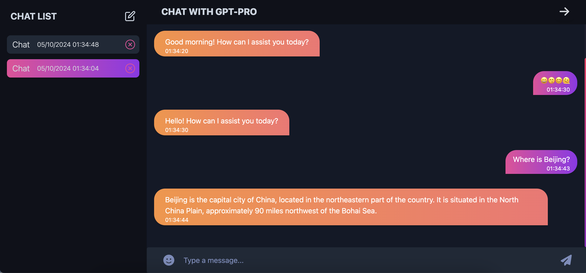
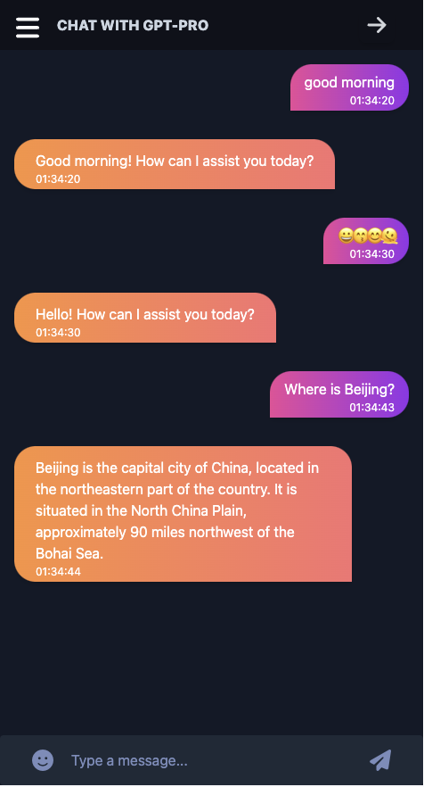

## GPT-Pro Web App
### Project Info
This is a Responsive CHATGPT project that uses the OpenAI GPT-3.5 API to generate text based on user input. The user can input a prompt and the AI will generate a response based on the prompt. 

### Technologies Used
- HTML
- CSS
- JavaScript
- OpenAI GPT-3.5 API
- Responsive Design
- React
- Tailwind CSS
- Vite
- React-Routing
- Axios

Picture of the project:




### Running the project

```bash
npm install
npm run dev
```

### Building the project

```bash
npm run build
```
